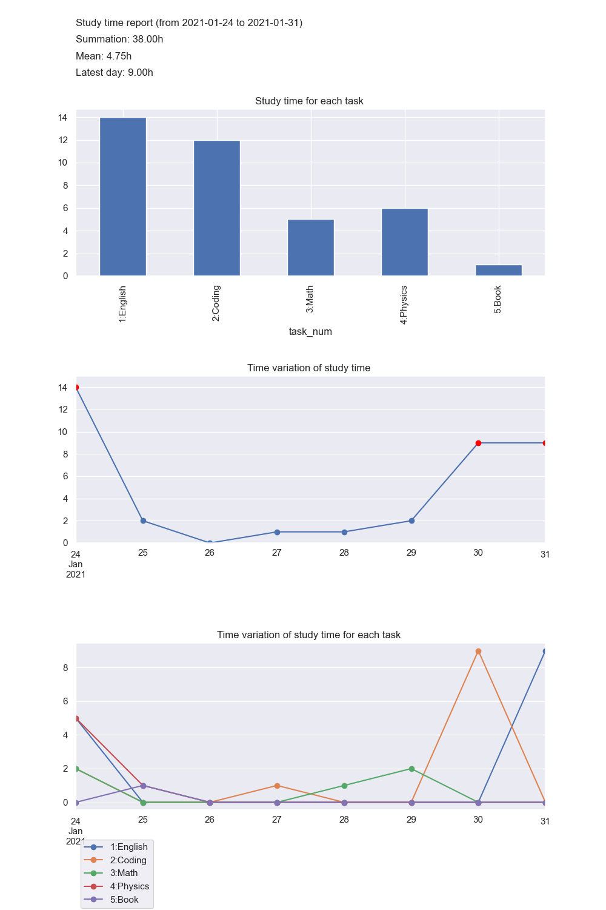

# 勉強時間可視化スクリプト
勉強時間を可視化するPythonスクリプトです。
下記のようなグラフを画像として出力することができます。



## 各グラフ説明
グラフは下記の3つ出力されます。
1. 各タスクごとの合計時間
1. 各日の勉強時間の時系列変化  
    土日祝日のplot点は赤くなります。
1. 各日のタスクごとの勉強時間の時系列変化

## 実行環境
下記コマンドで必要なパッケージをインストールできます。
```
poetry install
```

## 使い方
使い方は以下の通りです。
1. 勉強時間を記録したcsvファイルを用意する。  
    `sample.csv`と同じ形式でcsvファイルを作成してください。

    各行には左から`日付,タスク番号,開始時間,終了時間,メモ`を書きます。

2. configファイルに必要事項を入力する。  
    `config.yml`と同じ形式で、以下の3つを指定します。
    - filepath: csvファイルのパス
    - savepath: 出力画像のパス
    - task_dict: タスク番号とタスクの対応関係
3. mainスクリプトを実行する。  
    実行コマンドは以下のとおりです。
    ```
    poetry run python src/main.py --config_path path/to/config.yml
    ```


